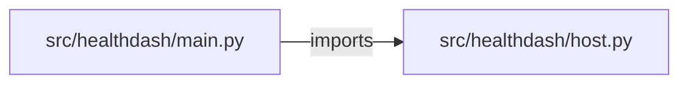

# system-health-dashboard — project architecture

[README](README.md) · [Interview questions and answers](INTERVIEW_QA.md)

## Purpose and scope

A small API reads the machine it is running on and grades load, memory, and each disk as `ok`, `warn`, or `critical`.

This document describes files and symbols in this checkout. Deployment templates and statements in the original overview are distinguished from a verified running environment.

## Component diagram



For Python repositories, arrows show resolved local imports, not network calls or deployment order. Otherwise the diagram is a repository component map; containment arrows do not assert runtime integration.

## Components and responsibilities

| Component | Responsibility |
| --- | --- |
| [`src/healthdash/main.py`](src/healthdash/main.py) | HTTP handlers: `GET /healthz`, `GET /host`, `GET /host/history`, `GET /metrics`, `GET /` |
| [`src/healthdash/host.py`](src/healthdash/host.py) | Functions: `parse_meminfo`, `memory_percent`, `disk_percent`, `level`, `evaluate`, `load_1m`, `read_host` |
| [`requirements.txt`](requirements.txt) | Implementation or supporting configuration |
| [`tests/test_host.py`](tests/test_host.py) | Executable checks and regression examples |
| [`.github/workflows/ci.yml`](.github/workflows/ci.yml) | GitHub Actions job definitions |
| [`README.md`](README.md) | Project explanations or operating notes |

## Request interface

| Method and path | Handler | Source |
| --- | --- | --- |
| `GET /healthz` | `healthz` | [`src/healthdash/main.py`](src/healthdash/main.py#L20) |
| `GET /host` | `host` | [`src/healthdash/main.py`](src/healthdash/main.py#L25) |
| `GET /host/history` | `history` | [`src/healthdash/main.py`](src/healthdash/main.py#L30) |
| `GET /metrics` | `metrics` | [`src/healthdash/main.py`](src/healthdash/main.py#L36) |
| `GET /` | `dashboard` | [`src/healthdash/main.py`](src/healthdash/main.py#L41) |

The table lists literal route decorators found in the inspected Python modules. Router prefixes and middleware can add behavior; check the linked handler and application setup before calling an endpoint.

## Implementation walkthrough

### `evaluate(readings, warn=WARN_PERCENT, critical=CRITICAL_PERCENT)`

Source: [`src/healthdash/host.py`](src/healthdash/host.py#L49).

Calls visible in this function: `checks.items`, `checks.values`, `level`, `max`, `readings['disks'].items`, `round`.

```python
def evaluate(readings, warn=WARN_PERCENT, critical=CRITICAL_PERCENT):
    cpu_count = max(1, readings["cpu_count"])
    load = readings["load_1m"]
    load_percent = None if load is None else round(load / cpu_count * 100, 1)
    checks = {
        "load": level(load_percent, warn, critical),
        "memory": level(readings["memory_used_percent"], warn, critical),
    }
    for mount, percent in readings["disks"].items():
        checks[f"disk:{mount}"] = level(percent, warn, critical)
    alerts = [f"{name} is {state}" for name, state in checks.items() if state in {"warn", "critical"}]
    if "critical" in checks.values():
        status = "critical"
    elif "warn" in checks.values():
        status = "warn"
    else:
        status = "ok"
    return {
        **readings,
        "load_percent": load_percent,
        "checks": checks,
        "status": status,
```

The excerpt is truncated; the linked source contains the full implementation.

### `parse_meminfo(text)`

Source: [`src/healthdash/host.py`](src/healthdash/host.py#L11).

Calls visible in this function: `int`, `line.split`, `parts[0].isdigit`, `raw.strip`, `raw.strip().split`, `round`, `text.splitlines`, `values.get`.

```python
def parse_meminfo(text):
    values = {}
    for line in text.splitlines():
        if ":" not in line:
            continue
        key, raw = line.split(":", 1)
        parts = raw.strip().split()
        if parts and parts[0].isdigit():
            values[key] = int(parts[0])
    total = values.get("MemTotal") or 0
    available = values.get("MemAvailable")
    if total <= 0 or available is None:
        return None
    return round((total - available) / total * 100, 1)
```

### `prometheus(body)`

Source: [`src/healthdash/host.py`](src/healthdash/host.py#L100).

Calls visible in this function: `'\n'.join`, `body['disks'].items`, `lines.append`.

```python
def prometheus(body):
    lines = [
        "# TYPE host_cpu_count gauge",
        f"host_cpu_count {body['cpu_count']}",
        "# TYPE host_disk_used_percent gauge",
    ]
    for mount, percent in body["disks"].items():
        lines.append(f'host_disk_used_percent{{mount="{mount}"}} {percent}')
    if body["load_1m"] is not None:
        lines += ["# TYPE host_load_1m gauge", f"host_load_1m {body['load_1m']}"]
    if body["memory_used_percent"] is not None:
        lines += ["# TYPE host_memory_used_percent gauge", f"host_memory_used_percent {body['memory_used_percent']}"]
    lines += ["# TYPE host_status_critical gauge", f"host_status_critical {1 if body['status'] == 'critical' else 0}"]
    return "\n".join(lines) + "\n"
```

### `level(percent, warn=WARN_PERCENT, critical=CRITICAL_PERCENT)`

Source: [`src/healthdash/host.py`](src/healthdash/host.py#L39).

```python
def level(percent, warn=WARN_PERCENT, critical=CRITICAL_PERCENT):
    if percent is None:
        return "unknown"
    if percent >= critical:
        return "critical"
    if percent >= warn:
        return "warn"
    return "ok"
```

## Validation and failure paths

| Explicit exception | Source |
| --- | --- |
| `HTTPException(status_code=422, detail=f"not a directory: {', '.join(missing)}")` | [`src/healthdash/main.py`](src/healthdash/main.py#L15) |

These are explicit exceptions in the inspected source, rather than a claim that every failure is handled. Follow the calling handler to see whether the exception becomes an HTTP response or propagates.

## Data flow and design decisions

### What is the input-to-output contract of `evaluate`

In [`src/healthdash/host.py`](src/healthdash/host.py#L49), `evaluate(readings, warn=WARN_PERCENT, critical=CRITICAL_PERCENT)` receives the inputs. The function computes these intermediate values:

- `cpu_count = max(1, readings['cpu_count'])`
- `load = readings['load_1m']`
- `load_percent = None if load is None else round(load / cpu_count * 100, 1)`
- `checks = {'load': level(load_percent, warn, critical), 'memory': level(readings['memory_used_percent'], warn, critical)}`
- `alerts = [f'{name} is {state}' for name, state in checks.items() if state in {'warn', 'critical'}]`

Its result is defined by:

- `{**readings, 'load_percent': load_percent, 'checks': checks, 'status': status, 'alerts': alerts, 'thresholds': {'warn': warn, 'critical': critical}}`

### Which decision rules or boundary conditions should an interviewer challenge

The implementation in [`src/healthdash/host.py`](src/healthdash/host.py#L49) branches on:

- `'critical' in checks.values()`
- `'warn' in checks.values()`

A useful extension is a table-driven test that covers each condition just below, at, and above its boundary where applicable. These expressions are the current rules; changing them changes behavior and should be justified by the project’s acceptance criteria.

## Setup and verification

The following commands are derived from the checked-in dependency/test contracts. Execute them from the repository root; the block prepares a local environment, not a cloud deployment.

```bash
python3 -m venv .venv
source .venv/bin/activate
python -m pip install -r requirements.txt
python -m pytest -q
```

Python dependencies: [`requirements.txt`](requirements.txt).

Test entry points: [`tests/test_host.py`](tests/test_host.py).

Automation definitions: [`.github/workflows/ci.yml`](.github/workflows/ci.yml). Read their triggers and job steps to determine what CI actually runs.

## Operating boundaries and design review

Before turning this checkout into a customer deployment, establish the input contract, data ownership, access controls, failure response, evaluation criteria, and rollback owner. Repository fixtures and unit tests demonstrate local behavior; they do not establish throughput, uptime, compliance, or business impact.

A useful architecture review starts with the linked implementation: identify where input enters, where a decision is made, which state can change, and which external dependency can fail. Add a deployment view only for infrastructure that is actually configured and exercised.
